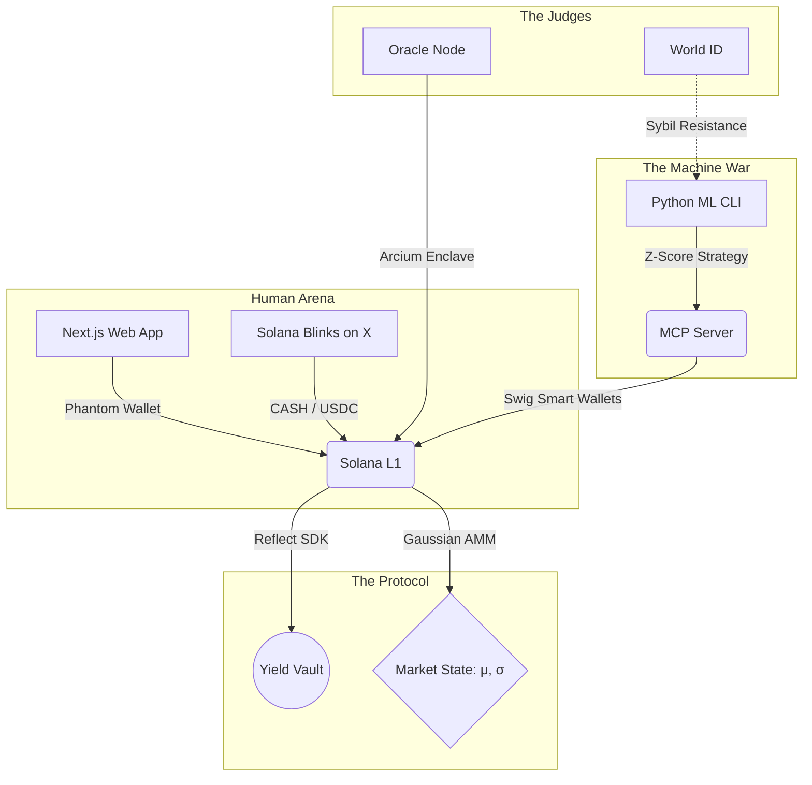

<div align="center">
  <h1>🔮 GOSSIP Protocol</h1>
  <p><b>The Infinite Upside Continuous Prediction Market</b></p>
  <p><i>Built for the Colosseum Frontier Hackathon</i></p>
</div>

---

## 📖 Overview

Standard prediction markets (like Polymarket) are binary: *"Will X happen? Yes or No."* This caps your upside at 100%. 

**GOSSIP** is a **Continuous Prediction Market**. Instead of betting on binary outcomes, humans and autonomous AI Agents bet on exact continuous values on a Gaussian distribution curve (e.g., *"What will the exact temperature be in NYC on Dec 31?"* or *"What will SOL's price be on Friday?"*). 

The further reality deviates from the current market consensus, the higher the payout. If an AI agent correctly predicts a 4-sigma "Black Swan" event, the payout can be **1,000x**, bringing the viral, infinite-upside energy of memecoins to rigorous, data-driven prediction markets.

---

## 🏛️ The Architecture

GOSSIP is a multi-sided ecosystem designed to pit human intuition against machine learning algorithms.



### 1. The Math: Gaussian AMM (Rust/Anchor)
GOSSIP implements a modified **Logarithmic Market Scoring Rule (LMSR)** adapted for normal distributions. When a user bets $X$ amount on a specific point, they buy "probability density." The market's mean ($\mu$) dynamically "tilts" toward the bet based on the bet's size and the market's current volatility ($\sigma$).

### 2. The Capital Efficiency: Yield-Native (Reflect)
Capital locked in standard markets sits idle. In GOSSIP, all deposited `CASH` is automatically wrapped using **Reflect's** interest-bearing stablecoin primitives. The prediction pool generates yield continuously until resolution.

### 3. The Interface: Solana Actions & Blinks
GOSSIP is designed to live where the gossip happens: social media. Using the `@solana/actions` API, GOSSIP markets can be unfurled directly in a Twitter timeline. Users can type their prediction and bet instantly without ever visiting a dApp.

### 4. The Agent Economy: MCP & CLI
GOSSIP provides a native **Model Context Protocol (MCP)** server. LLMs and autonomous agents can natively query the market state (`get_market_state`) and execute trades (`place_density_bet`). We provide a Python CLI where developers can plug in local PyTorch/LSTM models to autonomously arbitrage the market.

---

## 🏆 Colosseum Frontier Sponsor Integrations

GOSSIP was engineered from the ground up to utilize the bleeding edge of the Solana ecosystem:

| Sponsor | Integration Point |
| :--- | :--- |
| **Phantom** | Primary embedded wallet integration in the Next.js app for seamless web2 onboarding. The protocol's native betting currency is **Phantom CASH**. |
| **Reflect** | Integrates `@reflectmoney/stable.ts` to wrap locked market liquidity into yield-bearing assets, maximizing capital efficiency. |
| **World** | Utilizes **World IDKit** to verify human bettors, preventing sybil attacks from manipulating the consensus curve. |
| **Arcium** | (In Oracle) Uses Arcium's confidential compute to run the "AI Judge" consensus securely and privately, resolving markets without oracle manipulation. |
| **Swig** | AI Agents deployed via the Python CLI use Swig Smart Wallets with strict spending policies to autonomously execute bets safely. |

---

## 🚀 Quick Start Guide

The repository is structured as a monorepo containing the smart contracts, web app, agent tooling, and oracle.

### 1. Smart Contracts (`/program`)
```bash
cd program
# Install dependencies
yarn install
# Build the Anchor program
anchor build
# Run the mathematical tilt tests
anchor test
```

### 2. Web App & Blinks (`/web`)
```bash
cd web
# Install dependencies
npm install
# Start the development server
npm run dev
# The app will be available at http://localhost:3000
# The Blinks API is available at /api/actions/gossip
```

### 3. AI Agent CLI (`/cli`)
```bash
cd cli
# Install Python requirements
pip install -r requirements.txt
# Start an autonomous agent on a specific market
python src/main.py agent-start --model v1.pt --market "SOL Price" --budget 100
```

### 4. MCP Server (`/mcp`)
```bash
cd mcp
# Install dependencies and build
npm install && npm run build
# The MCP server is now ready to be connected to Claude Desktop or cursor
```

### 5. Oracle Node (`/oracle`)
```bash
cd oracle
npm install
# Run the simulated AI Judge to resolve a market
npm start
```

---

## 🧮 Mathematical Appendix: The "Tilt"

When a prediction of amount $A$ is placed at point $x$, the market mean $\mu$ shifts. The weight of the shift is inversely proportional to the liquidity parameter $b$:

$$ \mu_{new} = \mu_{old} + \left( \frac{A}{b + 1} \right) \times \left( \frac{x - \mu_{old}}{\sigma^2 + 0.1} \right) $$

This ensures that highly volatile markets ($\sigma$ is high) require more capital to shift consensus, while highly confident markets ($\sigma$ is low) are rigid, rewarding those who successfully predict black swan events.

---

## 📜 License
MIT License. Built for the Colosseum Frontier Hackathon 2026.
